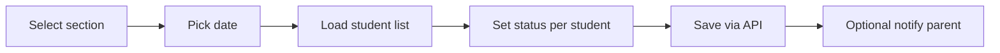

# User Stories & Use Cases

> **Document metadata**  
> Last reviewed: 2026-06-16  
> Routes: `npm run docs:sync` → `generated/frontend-routes.md`, `generated/api-routes.md`

---

## Actors

| Actor | Guard | Entry point |
|-------|-------|-------------|
| Center Admin | `users` → role `admin` | `/{centerSlug}/login` |
| Center Staff (limited) | `users` → role `user` | `/{centerSlug}/login` |
| Teacher | `teacher` | `/{centerSlug}/login` |
| Student | `student` | `/student/login` |
| Parent | `parent` | `/parent/login` |
| Platform Admin | `platform_admin` | `/platform/login` |

---

## Epic: Center admin daily operations

### US-ADM-01 — View dashboard

**As a** center admin  
**I want** a dashboard with key stats (students, teachers, revenue, attendance)  
**So that** I can assess center health at a glance  

**Use case: View admin dashboard**

| Step | Action |
|------|--------|
| 1 | Admin logs in at `/{slug}/login` with guard `users` |
| 2 | System initializes center context and redirects to `/admin` |
| 3 | SPA calls `GET /api/dashboard` and `GET /api/admin/bootstrap` |
| 4 | Dashboard renders stat cards, charts, unpaid student widget |

**Postconditions:** Admin sees center-scoped data only.

---

### US-ADM-02 — Record section attendance

**As a** center admin  
**I want** to mark attendance for a section on a specific date  
**So that** parents and reports stay accurate  

**Use case: Record attendance**

| Step | Action |
|------|--------|
| 1 | Navigate `/admin/attendance` → choose section |
| 2 | Open form `/admin/attendance/:sectionId/:date` |
| 3 | `GET /api/admin/attendance/section/{id}/date/{date}` |
| 4 | Edit statuses; `POST` same endpoint |
| 5 | Optional: notification/WhatsApp from legacy Blade flow |

---

### US-ADM-03 — Manage fee payments

**As a** center admin  
**I want** to record payments for students in a section  
**So that** I track who paid each month  

**Use case: Record payments**

| Step | Action |
|------|--------|
| 1 | `/admin/payments` → select section and date |
| 2 | Load students with fee definitions |
| 3 | Mark payment status and amount |
| 4 | Save; view history at `/admin/payments/.../history` |

---

## Epic: Teacher workflows

### US-TCH-01 — Take attendance for my classes

**As a** teacher  
**I want** to see only my assigned sections  
**So that** I record attendance quickly  

**Acceptance:** Teacher bootstrap filters sections by `teacher_section` pivot.

---

### US-TCH-02 — Run online class

**As a** teacher  
**I want** to join a LiveKit room for a scheduled meeting  
**So that** I teach remotely  

**Use case: Join LiveKit meeting**

| Step | Action |
|------|--------|
| 1 | `/teacher/meetings` — list upcoming meetings |
| 2 | Click join → `/teacher/meetings/:id/livekit` |
| 3 | `GET /api/teacher/meetings/{id}/livekit-token` |
| 4 | Client connects with `livekit-client` |

---

## Epic: Student portal

### US-STU-01 — View schedule and join class

**As a** student  
**I want** to see meetings and join video  
**So that** I attend online sessions  

**Flow:** `/student/login` → portal auth → `/student/meetings` → LiveKit room.

---

### US-STU-02 — Submit homework

**As a** student  
**I want** to upload homework answers  
**So that** teachers can review my work  

**API:** `POST /api/student/homework/submissions` (own student profile only).

---

## Epic: Parent portal

### US-PRN-01 — Monitor children

**As a** parent  
**I want** one dashboard for all my children  
**So that** I track attendance, grades, and fees  

**Flow:** `/parent/login` → if multiple centers, select membership → `/parent`.

---

### US-PRN-02 — Multi-center switch

**As a** parent enrolled in two centers  
**I want** to switch center without re-entering password  
**So that** I check both children's schools  

**API:** `POST /api/auth/switch-center` with `membership_id`.

---

## Epic: Platform operator

### US-PLT-01 — Provision new center

**As a** platform admin  
**I want** to create a center with slug and domain  
**So that** a new school can onboard  

**Use case: Create center**

| Step | Action |
|------|--------|
| 1 | Login `/platform/login` |
| 2 | `/platform/tenants` → create center |
| 3 | `POST /api/platform/centers` |
| 4 | `SetupCenter` job runs migrations/seed for center |
| 5 | Center accessible at `{slug}.{APP_DOMAIN}` or slug header |

---

## Epic: Public marketing

### US-PUB-01 — View center landing page

**As a** prospective student/parent  
**I want** to read about a center on a public page  
**So that** I can decide to enroll  

**URL:** `/{centerSlug}/p/{pageSlug}` — no authentication.

---

## Cross-cutting use cases

### UC-AUTH — Login with global identity

| Condition | Path |
|-----------|------|
| Parent/student, single center | Direct login → dashboard |
| Parent/student, multiple centers | Login → membership picker → `switch-center` |
| Admin/teacher | Must provide center slug |
| Platform admin | No center context |

### UC-LOCALE — Switch language

| Step | Action |
|------|--------|
| 1 | User toggles EN/AR in header |
| 2 | `LocaleContext` updates strings, `dir=rtl` for Arabic |
| 3 | Fonts switch to Cairo / Noto Sans Arabic |

---

## Error scenarios

| Scenario | Expected behavior |
|----------|-------------------|
| Wrong password | 401 JSON message |
| Expired session | Redirect to appropriate login |
| Access wrong role route | Redirect to role dashboard |
| Center not found | 404 / center required error |
| Student writes meeting | 403 Forbidden |

---

## Related documents

- [PRD](./03-product-requirements.md)
- [API](./07-api.md)
- [UI/UX](./08-ui-ux.md)
