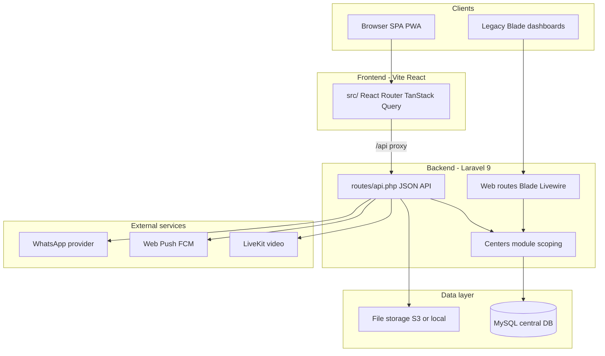
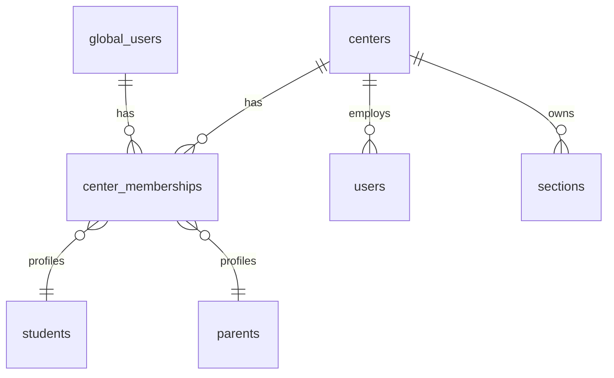
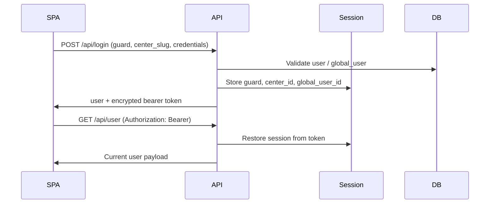

# System Architecture Documentation

> **Document metadata**  
> Last reviewed: 2026-06-16  
> Regenerate routes/tables: `npm run docs:sync`

---

## 1. Architecture overview

EduCenter follows a **decoupled SPA + API** pattern with a **shared-database multi-center** isolation model.

---

## 2. Multi-center isolation

**Model:** Single MySQL database; rows isolated by `center_id` or via `center_memberships`.

| Component | Path | Role |
|-----------|------|------|
| `CenterContextManager` | `backend/app/Centers/` | Resolves center from slug, header, subdomain, session |
| `CenterScopedConnection` | `backend/app/Database/` | Auto-applies `WHERE center_id = ?` on queries |
| `BelongsToCenter` trait | `backend/app/Models/Concerns/` | Model-level scoping |
| `GlobalMembershipService` | `backend/app/Centers/` | Parent/student cross-center identity |
| Config | `backend/config/centers.php` | Scoped table list, central domains |

**Center resolution order:**
1. `X-Center-Slug` / `X-Tenant-Slug` header (SPA)
2. Subdomain `{slug}.{APP_DOMAIN}` (`InitializeCenterFromSubdomain`)
3. Session `api_center_id`
4. Login payload `center_slug`

---

## 3. Services & modules

### Frontend (`/`)

| Module | Location | Responsibility |
|--------|----------|----------------|
| Routing | `src/App.tsx` | Role-based protected routes |
| Auth | `src/contexts/AuthContext.tsx` | Token, user, tenant context |
| i18n | `src/contexts/LocaleContext.tsx` | EN/AR, RTL |
| API client | `src/services/apiClient.ts` | Bearer token, center headers |
| Endpoints | `src/services/endpoints/` | Domain API wrappers |
| UI | `src/components/ui/` | shadcn/Radix design system |

### Backend (`backend/`)

| Module | Location | Responsibility |
|--------|----------|----------------|
| API layer | `routes/api.php` | SPA JSON endpoints (~130 routes) |
| Auth | `AuthLoginHandler`, `ApiBearerAuth` | Multi-guard login, encrypted bearer |
| Admin domain | `Repository/Admin/*`, Admin controllers | CRUD and reports |
| Platform | `PlatformCenterApiController` | Center lifecycle |
| Jobs | `SetupCenter`, `DeleteCenterData` | Async provisioning |
| Legacy UI | `routes/admin.php`, etc. | Blade dashboards |

---

## 4. Databases

| Store | Technology | Contents |
|-------|------------|----------|
| Primary | MySQL 8+ | All platform + center data |
| Cache | File/Redis (optional) | Laravel cache, sessions |
| Queue | Database/Redis | Center setup jobs |
| Media | Local or S3 | Uploads, Spatie Media Library |

**Connection names:**
- `mysql` — central/platform tables (`centers`, `global_users`, `center_memberships`, `admins`)
- `center` — scoped operational tables (auto-filtered)

Full table list: [`generated/database-tables.md`](./generated/database-tables.md)

---

## 5. APIs

| Surface | Base path | Consumers |
|---------|-----------|-----------|
| SPA API | `/api/*` | React app |
| Public landing | `GET /api/public/landing/{slug}` | Marketing pages |
| Legacy AJAX | `/ajax/*` | Blade dropdowns |
| Config | `GET /api/config` | Returns `tenancy_mode: central_shared` |

Full route list: [`generated/api-routes.md`](./generated/api-routes.md)

**Dev proxy:** Vite `8080` → Laravel `8000` for `/api` and `/storage`.

---

## 6. Authentication architecture

**Guards:** `web`, `teacher`, `student`, `parent`, `platform_admin` — see `backend/config/auth.php`.

---

## 7. Infrastructure (typical deployment)

| Layer | Component |
|-------|-----------|
| Reverse proxy | Nginx (aaPanel or similar) |
| PHP | PHP-FPM 8.1+, Laravel `public/index.php` |
| Static SPA | `dist/` served as static files; fallback `index.html` |
| API | Nginx location `/api` → PHP (not SPA fallback) |
| MySQL | Single instance or managed DB |
| SSL | Let's Encrypt |
| Video | LiveKit server (cloud or self-hosted) |

See [Deployment Documentation](./11-deployment.md).

---

## 8. Integrations

| Service | Config | Usage |
|---------|--------|-------|
| LiveKit | `LIVEKIT_*` env | Meeting tokens, WebRTC |
| Web Push | VAPID keys | Parent/student notifications |
| FCM | `FCM_*` | Mobile push |
| WhatsApp | Templates in DB | Attendance/grade messages |
| Zoom | `ZOOM_*` | Legacy online classes |
| Pusher | `PUSHER_*` | Optional realtime |

---

## 9. Legacy vs modern stack

| Aspect | Modern (primary) | Legacy |
|--------|------------------|--------|
| UI | React SPA | Blade + Livewire 2 |
| API | `routes/api.php` | Form posts to web routes |
| Tenancy term | Center | Tenant (aliases remain) |
| Video | LiveKit | Zoom (optional) |

New features should target the SPA API first.

---

## Related documents

- [Database](./06-database.md)
- [API](./07-api.md)
- [Security](./10-security.md)
- [Deployment](./11-deployment.md)
