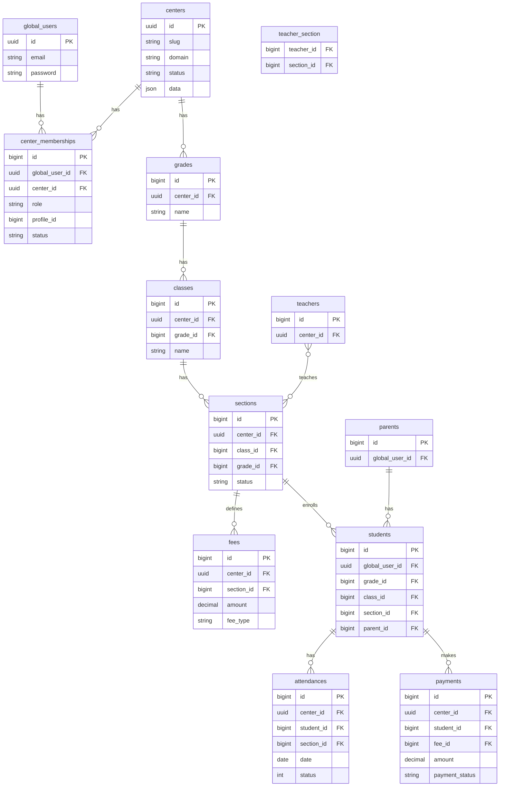

# Database Documentation

> **Document metadata**  
> Last reviewed: 2026-06-16  
> **Auto-generated table list:** run `npm run docs:sync` → [`generated/database-tables.md`](./generated/database-tables.md)

---

## 1. Data model overview

EduCenter uses a **single MySQL database** with logical isolation per center.

| Layer | Tables | Scoping |
|-------|--------|---------|
| Platform | `centers`, `global_users`, `center_memberships`, `admins` | Not center-scoped |
| Identity-linked | `students`, `parents` | Via `center_memberships.profile_id` |
| Operational | grades, classes, sections, fees, etc. | `center_id` column |
| RBAC | roles, permissions, pivots | `center_id` on permission tables |

---

## 2. Entity relationship diagram (core domain)



---

## 3. Platform tables

### `centers`

| Column | Type | Notes |
|--------|------|-------|
| `id` | UUID PK | Center identifier |
| `slug` | string unique | URL/subdomain key |
| `domain` | string nullable | Custom domain |
| `status` | string | active, suspended, etc. |
| `data` | JSON | Plan, subscription metadata |

### `global_users`

Cross-center identity for parents and students.

| Column | Type | Notes |
|--------|------|-------|
| `id` | UUID PK | |
| `email` | string unique | Login identifier |
| `password` | string | bcrypt |
| `name`, `phone` | string | Profile |

### `center_memberships`

| Column | Type | Notes |
|--------|------|-------|
| `global_user_id` | UUID FK | |
| `center_id` | UUID FK | |
| `role` | enum-like | `parent`, `student` |
| `profile_id` | bigint | FK to `parents.id` or `students.id` |
| `status` | string | active/inactive |

---

## 4. Academic & people tables

| Table | Purpose | Key FKs |
|-------|---------|---------|
| `grades` | Grade levels | `center_id` |
| `classes` | Subjects/courses | `grade_id`, `center_id` |
| `sections` | Scheduled groups | `class_id`, `grade_id`, `center_id` |
| `teacher_section` | Teacher assignment | `teacher_id`, `section_id` |
| `students` | Student profiles | `grade_id`, `class_id`, `section_id`, `parent_id`, `global_user_id` |
| `parents` | Parent profiles | `global_user_id` |
| `teachers` | Teacher accounts | `center_id` |
| `users` | Admin/staff | `center_id` + Spatie roles |

---

## 5. Operations tables

| Table | Purpose |
|-------|---------|
| `fees` | Fee definitions by section |
| `payments` | Payment records |
| `attendances` | Daily attendance |
| `quiz_degrees` | Quiz scores |
| `exam_degrees` | Exam scores |
| `homeworks` | Assignments |
| `student_homework` | Submissions |
| `meetings`, `meeting_series` | Online/offline classes |
| `library` | Shared files |
| `announcements` | Center announcements |

---

## 6. Curriculum & assessment

| Table | Purpose |
|-------|---------|
| `units`, `lessons` | Curriculum structure |
| `questions`, `answers` | Q&A bank |
| `words` | Vocabulary |
| `notes` | Polymorphic notes |

---

## 7. Admin & comms

| Table | Purpose |
|-------|---------|
| `settings` | Center configuration key/value |
| `whatsapp_templates` | Message templates |
| `certification_templates` | PDF certificate layouts |
| `activity_logs` | Audit trail |
| `notifications` | Laravel notifications |
| `landing_pages`, `landing_page_revisions`, `landing_page_analytics`, `landing_media` | Marketing builder |

---

## 8. RBAC (Spatie)

| Table | Notes |
|-------|-------|
| `roles`, `permissions` | Scoped with `center_id` |
| `model_has_roles`, `model_has_permissions`, `role_has_permissions` | Pivots |

Seeded by `database/seeders/Center/RolesAndPermissionsSeeder.php` per center.

---

## 9. Indexes & constraints

| Pattern | Application |
|---------|-------------|
| `center_id` index | All scoped tables (see `config/centers.php`) |
| UUID PK on `centers` | Stable center reference |
| Soft deletes | `students` (`deleted_at`) |
| FK constraints | grade → class → section hierarchy |
| Unique | `centers.slug`, `global_users.email` |

**Query scoping:** Application layer enforces center filter via `CenterScopedConnection` — do not rely on indexes alone for security.

---

## 10. Migration workflow

```bash
cd backend
php artisan migrate                    # Platform + shared schema
php artisan centers:install            # Center module setup
php artisan centers:backfill           # Migrate legacy tenant data (if applicable)
```

Migration files: `backend/database/migrations/`  
Order for center tables: `config/centers.php` → `migration_order`

---

## 11. Auto-generated reference

After schema changes, run:

```bash
npm run docs:sync
```

Then review [`generated/database-tables.md`](./generated/database-tables.md) for the complete migration → table mapping and scoped table list.

---

## Related documents

- [System Architecture](./05-system-architecture.md)
- [API](./07-api.md)
- [Security](./10-security.md) — data isolation
