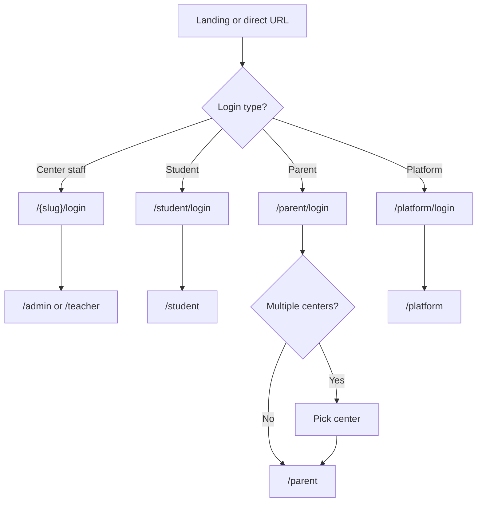

# UI/UX Documentation

> **Document metadata**  
> Last reviewed: 2026-06-16  
> Routes: `npm run docs:sync` → [`generated/frontend-routes.md`](./generated/frontend-routes.md)  
> i18n: `src/contexts/LocaleContext.tsx`

---

## 1. Design principles

| Principle | Application |
|-----------|-------------|
| **Role-first navigation** | Each role sees a tailored sidebar (admin, teacher, student, parent, platform) |
| **Bilingual by default** | EN/AR toggle on all authenticated screens |
| **RTL-aware** | Arabic sets `dir=rtl` and Arabic fonts |
| **Mobile-ready** | Responsive layouts; bottom nav on small screens in dashboard |
| **Consistent CRUD** | Admin lists use `CrudPage` + `DataTable` + `FormDialog` |
| **Brand identity** | Crimson primary (`#ba181b`), clean cards, elevated shadows |

---

## 2. Design system

### 2.1 Component library

**shadcn/ui** (Radix primitives) — config in `components.json`.

Location: `src/components/ui/` — Button, Card, Dialog, Table, Form, Sidebar, Chart, etc.

### 2.2 Color tokens

Defined in `src/index.css` and `tailwind.config.ts`:

| Token | Usage |
|-------|-------|
| `--primary` | Brand crimson — CTAs, active nav |
| `--secondary`, `--muted` | Surfaces, secondary text |
| `--destructive` | Delete actions |
| `--success`, `--warning`, `--info` | Status feedback |
| `--attendance`, `--finance`, `--exams`, `--alerts` | Domain-specific accents |
| Sidebar tokens | `--sidebar-background`, `--sidebar-primary`, etc. |

### 2.3 Typography

| Context | Font |
|---------|------|
| English UI | Inter (body), Plus Jakarta Sans (display) |
| Arabic UI | Cairo, Noto Sans Arabic |
| Code | System monospace |

### 2.4 Spacing & radius

- Base radius: `--radius` (0.5rem)
- Utility classes: `.page-header`, `.page-title`, `.page-description`, `.stat-card`

### 2.5 Dark mode

CSS variables for `.dark` are defined; **no global theme toggle** is wired in the app yet. Future enhancement.

---

## 3. Layout components

### `DashboardLayout`

- Collapsible sidebar with grouped sections per role
- Header: locale toggle, user menu, sign out
- Mobile: bottom navigation bar
- PWA install button in sidebar

### Marketing `LandingPage`

- Framer Motion animations
- Role preview cards linking to login flows
- Public EN/AR content

---

## 4. Screen inventory by role

### Public

| Route | Screen | Purpose |
|-------|--------|---------|
| `/` | Marketing landing | Product introduction |
| `/:tenantSlug/login` | Center login | Admin & teacher |
| `/student/login` | Student portal login | Cross-center |
| `/parent/login` | Parent portal login | Cross-center |
| `/platform/login` | Platform login | Operators |
| `/:tenantSlug/p/*` | Public landing page | Center marketing |

### Admin (`/admin/*`)

Dashboard, Students, Teachers, Parents, Grades, Classes, Sections, Attendance (+ form/history), Fees, Exams (+ form/history), Quizzes (+ form/history), Payments (+ form/history), Library, Announcements, Reports, Settings, Units, Lessons, Homework, Meetings, Meeting Series, Users, Roles, Landing Pages (+ builder + analytics)

### Teacher (`/teacher/*`)

Dashboard, Classes, Attendance, Exams, Quizzes, Homework, Library, Meeting Series, Meetings, LiveKit room

### Student (`/student/*`)

Dashboard, Meetings, LiveKit room, Attendance, Grades, Homework, Library

### Parent (`/parent/*`)

Dashboard, Children, Attendance, Exams, Quizzes, Fees, Reports

### Platform (`/platform/*`)

Dashboard, Tenants (centers), Subscriptions, Users, Roles, Activity Logs

**Full list:** [`generated/frontend-routes.md`](./generated/frontend-routes.md)

---

## 5. User flows

### 5.1 Authentication flow



### 5.2 Section/date operational flow (attendance, exams, payments)

Shared pattern across admin modules:

1. Index page — list sections or pick from bootstrap
2. Select date (calendar or date input)
3. Form page — table of students with inline edits
4. Save → toast success → optional history view

Routes follow: `/admin/{module}/:sectionId/:date` and `/admin/{module}/:sectionId/history`

### 5.3 LiveKit meeting flow

1. Meetings list with status and time
2. "Join" → dedicated full-screen LiveKit page
3. Token fetched on mount; connection states shown (connecting, connected, error)

---

## 6. Wireframes (structural)

### Admin dashboard (ASCII)

```
+------------------------------------------------------------------+
| [Logo] EduCenter          [EN|AR]  [User v]                      |
+----------+-------------------------------------------------------+
| Sidebar  |  Dashboard                                            |
| - Home   |  +--------+ +--------+ +--------+ +--------+          |
| - People |  |Students| |Teachers| | Revenue| |Attendance|        |
| - Academics| +--------+ +--------+ +--------+ +--------+        |
| - Finance|  [Chart: attendance by grade]                         |
| - Reports|  [Table: unpaid students this month]                  |
+----------+-------------------------------------------------------+
```

### CRUD list page pattern

```
+ Page title + [Add button]
+ Filters (search, dropdowns)
+ DataTable (sortable columns, row actions)
+ FormDialog for create/edit
+ DeleteDialog confirmation
```

---

## 7. Responsive behavior

| Breakpoint | Behavior |
|------------|----------|
| `< md` | Sidebar collapses; bottom nav for primary links |
| `md+` | Persistent sidebar |
| Tables | Horizontal scroll on narrow screens |
| Forms | Single column on mobile; two columns on desktop |
| LiveKit | Full viewport; minimal chrome |

Tailwind breakpoints: default `sm`, `md`, `lg`, `xl`, `2xl`.

---

## 8. Localization & RTL

| Feature | Implementation |
|---------|----------------|
| Toggle | Header locale switch |
| Strings | `LocaleContext` keys (~1400+ lines) |
| Direction | `document.documentElement.dir = rtl` for Arabic |
| Numbers/dates | `date-fns` with locale where applied |
| Login/marketing | Separate theme in `login-theme.ts` |

Reference: [`UI_UX_PROMPT_EGYPT_AR.md`](./UI_UX_PROMPT_EGYPT_AR.md) for Egypt/Arabic UX guidance.

---

## 9. PWA UX

| Element | Location |
|---------|----------|
| Manifest | `vite.config.ts` — name EduCenter, theme `#ba181b` |
| Install prompt | `PwaInstallButton` on landing + dashboard |
| iOS hint | Tooltip for "Add to Home Screen" |
| Offline | Service worker caches static assets; API not cached |

---

## 10. Accessibility notes

- Radix components provide keyboard focus management for dialogs/menus
- Form labels via shadcn `Form` + `Label`
- Color contrast: primary crimson on light backgrounds meets WCAG for large text; verify small text in audits
- RTL: mirror layouts via logical properties where possible

---

## Related documents

- [User Stories](./04-user-stories-and-use-cases.md)
- [PRD](./03-product-requirements.md)
- [Development](./09-development.md)
