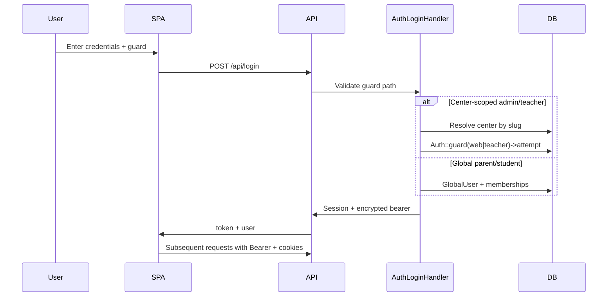

# Security Documentation

> **Document metadata**  
> Last reviewed: 2026-06-16  
> Implementation: `backend/app/Http/Support/`, `backend/config/auth.php`, `backend/app/Centers/`

---

## 1. Security overview

EduCenter handles **PII** (student/parent names, contacts), **financial records** (fees/payments), and ** educational data**. Security relies on:

- Multi-guard authentication
- Center-level data isolation
- Encrypted API bearer tokens
- Role-based access control (Spatie)
- HTTPS in production

---

## 2. Authentication flow

### Token format

- `ApiBearerAuth` encrypts payload: guard, user_id, center_id, expiry
- Invalid/expired token → 401
- Token does not replace server-side session validation for mutating operations

### Session keys

| Key | Purpose |
|-----|---------|
| `api_auth_guard` | Active guard name |
| `api_center_id` | Current center UUID |
| `api_global_user_id` | Global user for parent/student |
| `api_portal_mode` | Portal browsing without center |

---

## 3. Authorization matrix

### Route-level by guard

| Resource | admin (`web`) | teacher | student | parent | platform_admin |
|----------|---------------|---------|---------|--------|----------------|
| Admin bootstrap/CRUD | ✅ | ❌ | ❌ | ❌ | ❌ |
| Teacher bootstrap/meetings | ❌ | ✅ | ❌ | ❌ | ❌ |
| Student portal | ❌ | ❌ | ✅ | ❌ | ❌ |
| Parent portal | ❌ | ❌ | ❌ | ✅ | ❌ |
| Platform centers | ❌ | ❌ | ❌ | ❌ | ✅ |
| Public landing | ✅ (no auth) | ✅ | ✅ | ✅ | ✅ |

### Spatie permissions (center staff)

Default roles from `RolesAndPermissionsSeeder`:

| Role | Scope |
|------|-------|
| `admin` | All permissions within center |
| `user` | Subset (configurable) |

Permissions cover: grades, classes, students, fees, attendance, settings, etc.

### Data scoping

| Model type | Isolation mechanism |
|------------|---------------------|
| Standard operational | `center_id` auto-filter |
| Student, Parent | `center_memberships.profile_id` subquery |
| Platform tables | No center filter; platform guard only |

**Critical:** Never query center data without initializing `CenterContext`.

---

## 4. Encryption methods

| Data | Method |
|------|--------|
| Passwords | bcrypt (Laravel default) |
| API bearer token | Laravel `Crypt` (APP_KEY dependent) |
| Session cookies | Encrypted, HTTP-only, SameSite |
| APP_KEY | Required; rotate with session invalidation plan |
| Media at rest | Filesystem or S3 server-side encryption (hosting dependent) |
| TLS in transit | HTTPS required in production |

---

## 5. Input validation & OWASP mitigations

| Risk | Mitigation |
|------|------------|
| SQL injection | Eloquent ORM, parameterized queries |
| XSS | React escapes by default; sanitize rich text in landing builder |
| CSRF | Laravel CSRF for web; API uses session + bearer pattern |
| Mass assignment | `$fillable` on models; explicit validation in API |
| IDOR | Center scoping + ownership checks on student submissions |
| Broken auth | Guard checks on every API route group |

---

## 6. Backup policy

| Asset | Frequency | Retention | Owner |
|-------|-----------|-----------|-------|
| MySQL full dump | Daily | 7–30 days | Ops |
| `storage/app` uploads | Daily incremental | 30 days | Ops |
| `.env` secrets | Secure vault copy | Versioned securely | Ops |
| Code | Git remote | Indefinite | Dev |

**Restore test:** Quarterly restore to staging environment.

**Pre-deploy:** Always backup before migrations.

---

## 7. Incident response plan

### Severity levels

| Level | Example | Response time |
|-------|---------|---------------|
| S1 | Data breach, center isolation failure | Immediate |
| S2 | Auth bypass, API down | < 4 hours |
| S3 | Single center issue, non-critical bug | < 24 hours |

### Response steps

1. **Detect** — monitoring alerts, user report, audit logs
2. **Contain** — disable affected center (`status=suspended`), rotate APP_KEY if token compromise suspected
3. **Assess** — review `activity_logs`, MySQL audit, nginx access logs
4. **Notify** — affected centers per contractual/regional requirements
5. **Remediate** — patch, deploy, verify scoping tests
6. **Review** — post-incident document, update this section

### Contacts (fill in for your organization)

| Role | Contact |
|------|---------|
| Security lead | _TBD_ |
| Platform on-call | _TBD_ |
| Hosting provider | Contabo / aaPanel support |

---

## 8. Production checklist

- [ ] `APP_DEBUG=false`
- [ ] Strong `APP_KEY` (never commit)
- [ ] HTTPS only; HSTS enabled
- [ ] Database user least privilege (no SUPER for app user)
- [ ] Queue worker running for async jobs
- [ ] File upload size limits in nginx/PHP
- [ ] Rate limiting on `/api/login` (recommended — configure at nginx or middleware)
- [ ] Regular dependency updates (`composer audit`, `npm audit`)

---

## 9. Privacy considerations

- Student data linked to parents — access only via parent guard or admin
- Global identity stores email/phone centrally — minimize fields collected
- Activity logs may contain user actions — define retention policy
- WhatsApp/push require explicit subscription/consent flows

---

## Related documents

- [SRS — Non-functional requirements](./02-software-requirements.md#3-non-functional-requirements)
- [Deployment — secrets handling](./11-deployment.md)
- [Architecture — center isolation](./05-system-architecture.md)
