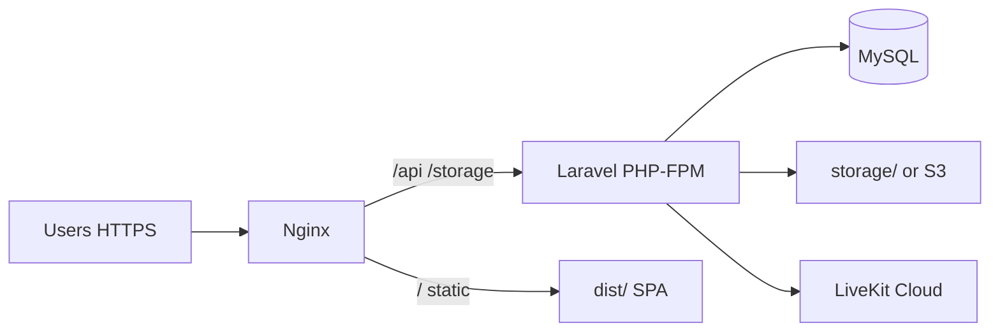

# Deployment Documentation

> **Document metadata**  
> Last reviewed: 2026-06-16  
> Detailed nginx guide: [`DEPLOYMENT_CONTABO_AAPANEL.md`](./DEPLOYMENT_CONTABO_AAPANEL.md)

---

## 1. Server requirements

| Component | Minimum | Recommended |
|-----------|---------|-------------|
| CPU | 2 vCPU | 4 vCPU |
| RAM | 4 GB | 8 GB |
| Disk | 40 GB SSD | 100 GB SSD |
| OS | Ubuntu 22.04 LTS | Same |
| PHP | 8.1+ | 8.2+ with OPcache |
| MySQL | 8.0 | 8.0 managed or dedicated |
| Node (build) | 18+ | 20 LTS (build machine only) |
| Web server | Nginx | Nginx + PHP-FPM |

**PHP extensions:** mbstring, openssl, pdo_mysql, tokenizer, xml, ctype, json, bcmath, fileinfo, gd/intl as needed

---

## 2. Deployment topology



**Critical nginx rule:** `/api` and `/storage` must route to Laravel — not SPA `try_files`.

---

## 3. Build & release process

### 3.1 Manual deployment

```bash
# On build machine or server
git pull origin main

# Frontend
npm ci
npm run build

# Backend
cd backend
composer install --no-dev --optimize-autoloader
php artisan migrate --force
php artisan config:cache
php artisan route:cache
php artisan view:cache
php artisan queue:restart
```

Copy `dist/` to web root; point Laravel `public/` for API or use combined nginx config.

### 3.2 CI/CD (recommended pattern)

No CI pipeline is committed yet. Suggested GitHub Actions workflow:

| Stage | Actions |
|-------|---------|
| **CI** | `npm ci`, `npm run lint`, `npm test`, `composer install`, `php artisan test` |
| **Build** | `npm run build`, artifact `dist/` |
| **Deploy** | SSH/rsync to server, run migrations, reload PHP-FPM |

Add `.github/workflows/deploy.yml` when ready — keep secrets in GitHub Actions secrets.

---

## 4. Environment variables (production)

### Laravel (`backend/.env`)

```env
APP_ENV=production
APP_DEBUG=false
APP_URL=https://yourdomain.com
APP_DOMAIN=yourdomain.com

DB_CONNECTION=mysql
DB_HOST=127.0.0.1
DB_DATABASE=edu_center
DB_USERNAME=edu_app
DB_PASSWORD=<strong-password>

CACHE_DRIVER=redis
SESSION_DRIVER=redis
QUEUE_CONNECTION=redis

GLOBAL_IDENTITY_ENABLED=true

LIVEKIT_URL=wss://your-livekit-host
LIVEKIT_API_KEY=
LIVEKIT_API_SECRET=

VAPID_PUBLIC_KEY=
VAPID_PRIVATE_KEY=
```

### Frontend (build-time)

Set before `npm run build`:

```env
VITE_API_BASE_URL=https://yourdomain.com/api
VITE_DEFAULT_LOCALE=en
VITE_USE_MOCK=false
```

---

## 5. Nginx configuration (summary)

```nginx
server {
    listen 443 ssl http2;
    server_name yourdomain.com *.yourdomain.com;

    root /www/wwwroot/edu-center/dist;
    index index.html;

    # Laravel API
    location /api {
        try_files $uri $uri/ /index.php?$query_string;
        root /www/wwwroot/edu-center/backend/public;
        fastcgi_pass unix:/tmp/php-cgi-81.sock;
        fastcgi_param SCRIPT_FILENAME /www/wwwroot/edu-center/backend/public/index.php;
        include fastcgi_params;
    }

    location /storage {
        alias /www/wwwroot/edu-center/backend/storage/app/public;
    }

    # SPA fallback
    location / {
        try_files $uri $uri/ /index.html;
    }
}
```

Adjust paths for aaPanel. Full walkthrough: [`DEPLOYMENT_CONTABO_AAPANEL.md`](./DEPLOYMENT_CONTABO_AAPANEL.md).

**Note:** That guide references database-per-tenant — current architecture uses **shared DB + center_id**. Skip tenant DB creation steps; use `php artisan centers:install` instead.

---

## 6. Docker configuration (reference)

No Dockerfile is in the repo yet. Reference stack for future `docker-compose.yml`:

```yaml
services:
  app:
    image: php:8.2-fpm
    volumes:
      - ./backend:/var/www/backend
  nginx:
    image: nginx:alpine
    ports:
      - "80:80"
      - "443:443"
  mysql:
    image: mysql:8.0
    environment:
      MYSQL_DATABASE: edu_center
  redis:
    image: redis:alpine
  queue:
    command: php artisan queue:work
```

Build SPA in CI and mount `dist/` into nginx container.

---

## 7. Post-deploy services

| Service | Command |
|---------|---------|
| Queue worker | `php artisan queue:work --sleep=3 --tries=3` (supervisor) |
| Scheduler | `* * * * * php artisan schedule:run` |
| OPcache | Enable in PHP-FPM for production |

---

## 8. Center subdomain setup

1. Wildcard DNS: `*.yourdomain.com` → server IP
2. `APP_DOMAIN=yourdomain.com` in `.env`
3. `InitializeCenterFromSubdomain` middleware resolves `{slug}.yourdomain.com`
4. Create centers via platform UI with matching `slug`

---

## 9. Rollback procedures

### Application rollback

```bash
git checkout <previous-tag>
npm ci && npm run build
cd backend && composer install --no-dev
php artisan config:cache
# Reload PHP-FPM / nginx
```

### Database rollback

1. Stop queue workers
2. Restore MySQL from last known-good backup
3. If partial migration failure: `php artisan migrate:rollback` (only if safe)
4. Restart workers

### SPA-only rollback

Redeploy previous `dist/` artifact without backend changes.

---

## 10. Monitoring

| Check | Method |
|-------|--------|
| API health | `GET /api/config` returns 200 |
| Queue | Supervisor status; failed_jobs table |
| Disk | `storage/` and MySQL size |
| SSL | Certbot auto-renew |
| Logs | `backend/storage/logs/laravel.log`, nginx error log |

---

## Related documents

- [Development setup](./09-development.md)
- [Security — backup & incident](./10-security.md)
- [Contabo + aaPanel guide](./DEPLOYMENT_CONTABO_AAPANEL.md)
