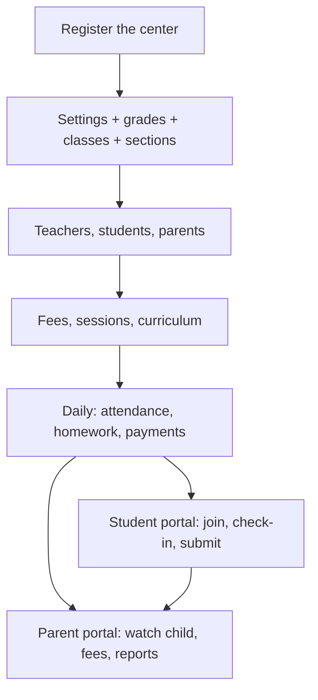

# Demo flows — Center, Student, Parent (A to Z)

> **Document metadata**  
> Last reviewed: 2026-09-12  
> Audience: product, support, and anyone filming demo videos  
> Related: [User Guide](./13-user-guide.md) (end-user Arabic), [Manual test plan](./14-manual-test-plan.md)

This file is a **filming script**, not a page catalog. Follow the scenes in order. Each scene is one camera shot: open the URL, click what is listed, say the voice-over, then cut.

Film **three videos**. Optionally add a fourth short “one school day” that stitches the three roles.

| Video | Who | Suggested length | Language on screen |
|-------|-----|------------------|--------------------|
| 1 | Education center (admin) | 12–18 min (or two parts: Setup / Daily work) | Arabic UI |
| 2 | Student | 6–8 min | Arabic UI |
| 3 | Parent | 5–7 min | Arabic UI |
| 4 (optional) | All three in one school day | 3–5 min | Arabic UI |

---

## How to film

1. Use a **demo center** with fake names (no real student phones or emails on screen).
2. Record at **1920×1080**, browser zoom **100%**, Arabic locale, desktop first.
3. Keep the mouse slow. Pause 1–2 seconds after every save so the toast is readable.
4. Do **not** show real passwords. Type `••••••••` already filled, or cut the typing.
5. Prepare sample files before recording: one PDF for the library, one image for a landing page, one homework file for the student.
6. Film Center **first**. Student and parent videos reuse the same data (same section, same homework, same payment).
7. Voice-over can be recorded later. Suggested Arabic lines are under each act.

**On-screen labels** below match the Arabic sidebar. English names are in parentheses for the editor.

---

## The story in one picture

Nothing in the student or parent apps works until the center has a **grade → class → section**, a **student in that section**, and (for fees/attendance) at least one **saved record**.

---

## Sample demo data (use the same names in every video)

| Field | Demo value |
|-------|------------|
| Center name | مركز النور |
| Center code (slug) | `noor` |
| Admin | Sara Admin · `sara@noor.test` |
| Teacher | أستاذ كريم |
| Student | يوسف محمد |
| Parent | محمد أحمد |
| Grade | أولى ثانوي |
| Class | علمي |
| Section | مجموعة أ |
| Fee | رسوم سبتمبر |

Login URLs after the center exists:

| Role | URL |
|------|-----|
| Center admin / teacher | `/noor/login` |
| Student | `/student/login` |
| Parent | `/parent/login` |

Replace `noor` with the slug you actually created.

---

# Video 1 — Center (admin) from A to Z

**Goal of the video:** a new center goes from empty to a working school: structure, people, classes, money, and communication.

Split into two published videos if needed:

- **1A — Setup** (scenes C1–C12)
- **1B — Daily work** (scenes C13–C22)

### Voice-over (act intro)

> **AR:** من هنا المركز يدير كل شيء: الطلاب، الحصص، الحضور، الرسوم، والتواصل مع أولياء الأمور. نبدأ من الصفر حتى يصبح المركز جاهزاً للعمل اليومي.  
> **EN:** This is the center workspace. We start from zero and finish with a center that can run a school day.

---

## Act 1 — Create the center and sign in

### Scene C1 — Public landing (optional, 20s)

- **URL:** `/`
- **Do:** Scroll the landing once. Click the center registration call-to-action (or go directly to `/center/register`).
- **Say (AR):** المنصة تجمع الإدارة والطالب وولي الأمر في مكان واحد.

### Scene C2 — Register the center (45s)

- **URL:** `/center/register`
- **Do:**
  1. Enter center name: مركز النور.
  2. Enter admin name, email, phone.
  3. Leave slug blank or type `noor` — show the login URL preview.
  4. Set password and confirm.
  5. Submit.
- **Expect:** Either auto-login to `/admin`, or redirect to `/noor/login`.
- **Say (AR):** نسجّل المركز مرة واحدة. بعدها رابط الدخول يكون خاصاً بالمركز.

### Scene C3 — Admin login (20s)

- **URL:** `/noor/login`
- **Do:** Sign in as admin. If a center picker appears, choose مركز النور.
- **Expect:** `/admin` dashboard.
- **Say (AR):** الإدارة والمعلم يدخلان من رابط المركز.

### Scene C4 — Admin home (20s)

- **URL:** `/admin`
- **Do:** Point at stats, then the sidebar groups (people, structure, sessions, finance).
- **Say (AR):** الصفحة الرئيسية ملخص اليوم. القائمة الجانبية فيها كل الأقسام.

---

## Act 2 — Settings and academic structure

Record this act **before** adding students. Empty structure is the most common setup mistake.

### Scene C5 — Center settings (30s)

- **URL:** `/admin/settings`
- **Do:**
  1. Confirm name, phone, address if shown.
  2. Optionally enable **الحصص التلقائية** (auto sessions): days ahead, duration, in-person or online.
  3. Save.
- **Say (AR):** نضبط بيانات المركز أولاً حتى تظهر في التقارير وصفحات التواصل.

### Scene C6 — Grades (30s)

- **URL:** `/admin/grades`
- **Do:** Add **أولى ثانوي**. Save. Show it in the list.
- **Say (AR):** المرحلة هي أول مستوى في الهيكل الدراسي.

### Scene C7 — Classes (25s)

- **URL:** `/admin/classes`
- **Do:** Add **علمي**, linked to أولى ثانوي.
- **Say (AR):** الفصل يتبع المرحلة.

### Scene C8 — Sections (40s)

- **URL:** `/admin/sections`
- **Do:**
  1. Add **مجموعة أ** under علمي.
  2. Set working days (e.g. Sun–Thu).
  3. Save. Open section sessions if the row has a sessions link.
- **Say (AR):** المجموعة هي الفصل الذي يحضر فيه الطلاب فعلياً. نحدد أيام العمل هنا.

**Cut rule:** On camera, say the order out loud: **مراحل ← فصول ← مجموعات**.

---

## Act 3 — People

### Scene C9 — Add a teacher (35s)

- **URL:** `/admin/teachers`
- **Do:** Create أستاذ كريم, assign **مجموعة أ**. Save.
- **Say (AR):** المعلم يُربَط بالمجموعة حتى يرى فقط طلابه.

### Scene C10 — Add a parent (30s)

- **URL:** `/admin/parents`
- **Do:** Create محمد أحمد with email and phone. Save.
- **Say (AR):** ولي الأمر يُربَط بالأبناء حتى يتابع الحضور والرسوم.

### Scene C11 — Add a student (45s)

- **URL:** `/admin/students`
- **Do:**
  1. Create يوسف محمد.
  2. Assign grade / class / **مجموعة أ**.
  3. Link parent محمد أحمد if the form offers it.
  4. Save. Open the student detail `/admin/students/:id` and show the code if visible.
- **Say (AR):** الطالب يجب أن يكون في مجموعة. بدون مجموعة لن يظهر في الحضور ولا الواجبات.

### Scene C12 — Assign by student code (optional, 30s)

- **URL:** `/admin/students`
- **Do:** Use **تعيين طالب بالكود**: search code → review → **تعيين للمركز**.
- **Say (AR):** إذا كان الطالب مسجّلاً في المنصة مسبقاً، نعيّنه بالكود فيُربَط هو وولي الأمر معاً.

---

## Act 4 — Curriculum and library

### Scene C13 — Unit, lesson, question (50s)

- **URLs:** `/admin/units` → `/admin/lessons` → `/admin/questions`
- **Do:** Add one unit, one lesson, one question with answers. Optionally open `/admin/questions/bulk` for a 5-second mention.
- **Say (AR):** بنك الأسئلة يُبنى من الدروس، وبعدها نستخدمه في الاختبارات.

### Scene C14 — Exam bank (40s)

- **URL:** `/admin/exam-bank` then `/admin/exam-bank/:id/builder`
- **Do:** Create an exam, add the question, save. Mention export PDF/Word without waiting for a long download.
- **Say (AR):** منشئ الاختبار يرتّب الأسئلة ويصدّرها عند الحاجة.

### Scene C15 — Homework (40s)

- **URL:** `/admin/homework`
- **Do:** Create homework for **مجموعة أ** with a due date (tomorrow). Save. Do **not** review submissions yet (student video will submit first).
- **Say (AR):** الواجب يظهر للطالب في مجموعته. نراجعه بعد التسليم.

### Scene C16 — Library (25s)

- **URL:** `/admin/library`
- **Do:** Upload the prepared PDF. Save.
- **Say (AR):** المكتبة هي الملفات المشتركة للدروس.

---

## Act 5 — Sessions

### Scene C17 — Schedule sessions (45s)

- **URL:** `/admin/sessions`
- **Do:**
  1. Filter to **مجموعة أ**.
  2. Create today’s session: in-person **or** online.
  3. If in-person: set venue / map if asked.
  4. Open attendance QR if available (needed for the student check-in video).
- **Say (AR):** الحصة الحضورية تحتاج موقعاً. الحصة الأونلاين تحتاج مزود بث أو رابط.

Optional 10s: `/admin/sections/:sectionId/sessions` to show generate-from-working-days.

---

## Act 6 — Classroom: attendance, exams, quizzes

### Scene C18 — Attendance (40s)

- **URL:** `/admin/attendance` → today for the section
- **Do:** Mark يوسف **حاضر**. Save. Open **السجل** and show the date.
- **Say (AR):** نسجّل الحضور لكل مجموعة وتاريخ. ولي الأمر يرى نفس اليوم لاحقاً.

### Scene C19 — Exam and quiz degrees (40s)

- **URLs:** `/admin/exams` then `/admin/quizzes`
- **Do:** Enter one exam score and one quiz score for يوسف. Save.
- **Say (AR):** درجات الامتحان والاختبار القصير تُحفظ على المجموعة والتاريخ.

---

## Act 7 — Fees and payments

### Scene C20 — Fee type then payment (50s)

- **URLs:** `/admin/fees` then `/admin/payments` (section / today)
- **Do:**
  1. Create **رسوم سبتمبر**.
  2. Open payments for **مجموعة أ**.
  3. Record a payment for يوسف (or leave one unpaid if you want the parent video to show a pending fee).
  4. Open payment history.
- **Say (AR):** نعرّف نوع الرسم أولاً، ثم نسجّل الدفع للمجموعة.

**Filming tip:** Leave **one unpaid fee** so the parent video has something to show.

---

## Act 8 — Communication and certificates

### Scene C21 — Announcement + notification (30s)

- **URLs:** `/admin/announcements` then `/admin/notifications`
- **Do:** Post a short announcement. Optionally send a notification.
- **Say (AR):** الإعلان يصل للطلاب. الإشعار يظهر على الجرس.

### Scene C22 — WhatsApp (40s)

- **URLs:** `/admin/whatsapp/templates` then `/admin/whatsapp`
- **Do:**
  1. Open or create a template (type: حضور or عام). Insert a variable. Show preview.
  2. On send: pick template, audience (أولياء أمور), section, generate links — **do not** actually spam a real number.
- **Say (AR):** القالب يُملأ باسم الطالب والتاريخ ثم يُرسل لولي الأمر.

### Scene C23 — Certificate (30s)

- **URLs:** `/admin/certifications/templates` then `/admin/certifications`
- **Do:** Open a template (or skip builder if long). Issue a certificate to يوسف.
- **Say (AR):** الشهادة تظهر بعد ذلك في حساب الطالب.

### Scene C24 — Landing page (30s, optional)

- **URL:** `/admin/landing`
- **Do:** Show list, mention publish. Do not spend time in the full builder unless this is a marketing-specific video.
- **Say (AR):** صفحات الهبوط للتعريف بالمركز على الإنترنت.

---

## Act 9 — Reports, staff access, wrap

### Scene C25 — Reports (40s)

- **URLs:** `/admin/reports` → `/admin/reports/attendance` → section report → `/admin/reports/payments`
- **Do:** Open attendance report for **مجموعة أ**. Show that today’s mark exists. Open payments report.
- **Say (AR):** التقارير تعتمد على ما سجّلناه اليوم: حضور ودفع.

### Scene C26 — Users and roles (20s, optional)

- **URLs:** `/admin/users` and `/admin/roles`
- **Do:** Point at roles. Do not change production permissions on camera.
- **Say (AR):** نحدد ما يراه كل موظف من الأدوار والصلاحيات.

### Scene C27 — Close the center video (15s)

- **URL:** `/admin`
- **Do:** Scroll the dashboard once more.
- **Say (AR):** المركز جاهز. الطالب يدخل من بوابته، وولي الأمر يتابع ابنه من بوابته.

---

# Video 2 — Student from A to Z

**Film after** the center video so sessions, homework, scores, library, and certificate already exist.

**Goal:** a student registers (or logs in), sees their center, joins class, checks in, submits homework, and finds scores.

### Voice-over (act intro)

> **AR:** بوابة الطالب لمتابعة الحصص، تسليم الواجبات، ورؤية الدرجات والحضور.  
> **EN:** The student portal is for sessions, homework, grades, and attendance.

---

## Act 1 — Enter the portal

### Scene S1 — Student register (40s) *or skip if the admin already created يوسف*

- **URL:** `/student/register`
- **Do:**
  1. Full name, email, phone, password.
  2. Select center **مركز النور**.
  3. Select grade, class, section (**أولى ثانوي / علمي / مجموعة أ**).
  4. Submit.
- **Expect:** Login or direct entry to `/student`.
- **Say (AR):** الطالب يختار مركزه ومرحلته ومجموعته عند إنشاء الحساب.

### Scene S2 — Student login (20s)

- **URL:** `/student/login`
- **Do:** Sign in. If several centers appear, pick مركز النور.
- **Expect:** `/student`.
- **Say (AR):** إذا كان الطالب في أكثر من مركز، يختار المركز بعد الدخول.

### Scene S3 — Student home (25s)

- **URL:** `/student`
- **Do:** Point at the banner (pending homework if any), stats, **مراكزي** / center tabs on mobile.
- **Say (AR):** الرئيسية تلخّص الحصص والحضور والواجبات المعلقة.

---

## Act 2 — Sessions and attendance

### Scene S4 — Sessions (30s)

- **URL:** `/student/sessions`
- **Do:** Show today’s session. If online, click through toward LiveKit / join (stop before a blank room if LiveKit is not configured).
- **Say (AR):** من هنا يلتحق الطالب بالحصة الحضورية أو الأونلاين.

### Scene S5 — Attendance history (20s)

- **URL:** `/student/attendance`
- **Do:** Show the **حاضر** mark the admin saved.
- **Say (AR):** سجل الحضور يعرض ما سجّله المركز أو المعلم.

### Scene S6 — QR check-in (40s)

- **URL:** `/student/attendance/check-in`
- **Do:**
  1. Allow camera + location if the browser asks (say this in VO; you can approve off-camera).
  2. Scan the session QR from scene C17 (second device or a printed QR).
  3. Show success.
- **If QR is not ready:** show the screen and say it is used when the center displays the session code.
- **Say (AR):** تسجيل الحضور بالرمز يكون أثناء الحصة، مع الموقع إذا طلب المركز ذلك.

---

## Act 3 — Learning work

### Scene S7 — Homework submit (50s)

- **URL:** `/student/homework`
- **Do:**
  1. Open the homework from scene C15.
  2. Attach the prepared file / write a short note.
  3. Submit. Show status change.
- **Say (AR):** الطالب يرفع الملف ويسلّم قبل الموعد. الإدارة والمعلم يراجعان التسليم بعد ذلك.

**Editor note:** After this scene, cut back 20s to `/admin/homework/:id/review` and mark the submission — that clip can live in the student video *or* the center daily-work video.

### Scene S8 — Exams and quizzes (25s)

- **URLs:** `/student/exams` then `/student/quizzes` (grades are also on `/student` cards)
- **Do:** Show the scores from scene C19.
- **Say (AR):** الدرجات تظهر بعد أن يسجّلها المركز أو المعلم.

### Scene S9 — Library (15s)

- **URL:** `/student/library`
- **Do:** Open the PDF uploaded in C16.
- **Say (AR):** المكتبة لتحميل المذكرات والملفات.

### Scene S10 — Certificates (15s)

- **URL:** `/student/certifications`
- **Do:** Show the issued certificate if you filmed C23.
- **Say (AR):** الشهادات الصادرة تظهر هنا للتحميل.

---

## Act 4 — Personal tools and close

### Scene S11 — Todos and notes (25s)

- **URLs:** `/student/todos` then `/student/notes`
- **Do:** Add one task “مراجعة الدرس” and one note. Mention they are private.
- **Say (AR):** المهام والملاحظات خاصة بالطالب ولا يراها غيره.

### Scene S12 — Close (10s)

- **URL:** `/student`
- **Say (AR):** هذا يوم الطالب: حصة، حضور، واجب، ودرجات.

---

# Video 3 — Parent from A to Z

**Film after** student + center data exist. The parent should already be linked to يوسف.

**Goal:** a parent signs in, picks a child, and understands attendance, scores, and money.

### Voice-over (act intro)

> **AR:** ولي الأمر لا يسجّل حضور ولا درجات. هو يتابع أبناءه: الدراسة والرسوم.  
> **EN:** Parents watch; they do not run the school.

---

## Act 1 — Enter the portal

### Scene P1 — Parent register (30s) *or skip if admin created the parent*

- **URL:** `/parent/register`
- **Do:** Name, email, phone, password, optional center. Submit.
- **Say (AR):** ولي الأمر ينشئ حساباً، ثم تربطه الإدارة بالأبناء.

### Scene P2 — Parent login (20s)

- **URL:** `/parent/login`
- **Do:** Sign in. If several centers, pick مركز النور.
- **Expect:** `/parent`.
- **Say (AR):** حساب واحد يمكن أن يتابع أبناء في أكثر من مركز.

### Scene P3 — Parent home (25s)

- **URL:** `/parent`
- **Do:** Point at child summary, attendance snapshot, fees. On a narrow window, show child tabs.
- **Say (AR):** الرئيسية ملخص لكل ابن: حضور ورسوم وآخر المستجدات.

---

## Act 2 — Follow the child

### Scene P4 — Children list (20s)

- **URL:** `/parent/children`
- **Do:** Open يوسف. Confirm no unrelated students appear.
- **Say (AR):** تظهر فقط الأبناء المرتبطون بهذا الحساب.

### Scene P5 — Attendance (25s)

- **URL:** `/parent/attendance`
- **Do:** Filter to يوسف. Show today’s **حاضر**.
- **Say (AR):** سجل الحضور هو نفسه الذي سجّله المركز.

### Scene P6 — Exams and quizzes (25s)

- **URLs:** `/parent/exams` then `/parent/quizzes`
- **Do:** Show the scores from the center video.
- **Say (AR):** النتائج تظهر بعد رصد الدرجات في المركز.

### Scene P7 — Fees (30s)

- **URL:** `/parent/fees`
- **Do:** Show paid vs unpaid for يوسف (the unpaid fee from C20).
- **Say (AR):** ولي الأمر يرى المستحق والمدفوع. الدفع الفعلي يتم في المركز.

### Scene P8 — Reports (20s)

- **URL:** `/parent/reports`
- **Do:** Open the combined report. Scroll once.
- **Say (AR):** التقرير يجمع الحضور والرسوم والدرجات في مكان واحد.

### Scene P9 — Close (10s)

- **URL:** `/parent`
- **Say (AR):** بهذا يعرف ولي الأمر: هل حضر الابن؟ هل عليه رسوم؟ ما نتيجته؟

---

# Video 4 (optional) — One school day (all three)

Film as a montage using clips you already have. Suggested order (about 4 minutes):

| Time | Clip | Line |
|------|------|------|
| 0:00 | `/admin` morning dashboard | الصباح في المركز |
| 0:20 | `/admin/sessions` today’s session | الحصة جاهزة |
| 0:40 | `/admin/attendance` mark present | نسجّل الحضور |
| 1:00 | `/student/attendance/check-in` | الطالب يؤكّد حضوره |
| 1:30 | `/student/homework` submit | يسلّم الواجب |
| 2:00 | `/admin/homework/.../review` | الإدارة تراجع |
| 2:30 | `/admin/payments` | دفعة اليوم |
| 3:00 | `/parent/attendance` + `/parent/fees` | ولي الأمر يتابع |
| 3:40 | `/admin` | نهاية اليوم |

---

## Recording checklist

### Before camera

- [ ] Demo center created; slug known
- [ ] Arabic UI
- [ ] Grade / class / section exist
- [ ] Teacher, student, parent exist and are linked
- [ ] One session today (QR ready if filming check-in)
- [ ] One homework not yet submitted
- [ ] One fee, preferably one unpaid
- [ ] Sample PDF + homework file on the desktop
- [ ] Notifications / WhatsApp: use fake numbers only

### After Center video

- [ ] Attendance saved for the demo student
- [ ] At least one exam or quiz score saved
- [ ] Homework still waiting **or** you planned the admin-review cutaway
- [ ] Certificate issued if you will show `/student/certifications`

### After Student video

- [ ] Homework submitted so parent/admin review is not empty

### After Parent video

- [ ] Child list shows only the demo child
- [ ] Fees screen matches what you recorded in the center

---

## Suggested titles for YouTube / WhatsApp status

| Video | Arabic title | English title |
|-------|----------------|---------------|
| 1 | من الصفر حتى تشغيل المركز | Center setup A to Z |
| 1B | يوم عمل في إدارة المركز | Center daily operations |
| 2 | دليل الطالب: الحصص والواجبات | Student portal A to Z |
| 3 | دليل ولي الأمر: متابعة الابن | Parent portal A to Z |
| 4 | يوم دراسي كامل على المنصة | One school day on EduCenter |

---

## What not to film

- Platform operator screens (`/platform`) — that is a different audience.
- Developer API tester.
- Real LiveKit rooms with other students’ faces unless you have consent.
- Failed 500 errors. If a screen is empty, skip it and film after the data exists.

---

## Related documents

- [User Guide](./13-user-guide.md) — Arabic screenshots and page help
- [Manual test plan](./14-manual-test-plan.md) — QA checklist if a scene fails
- [User stories](./04-user-stories-and-use-cases.md) — product intent behind each role
